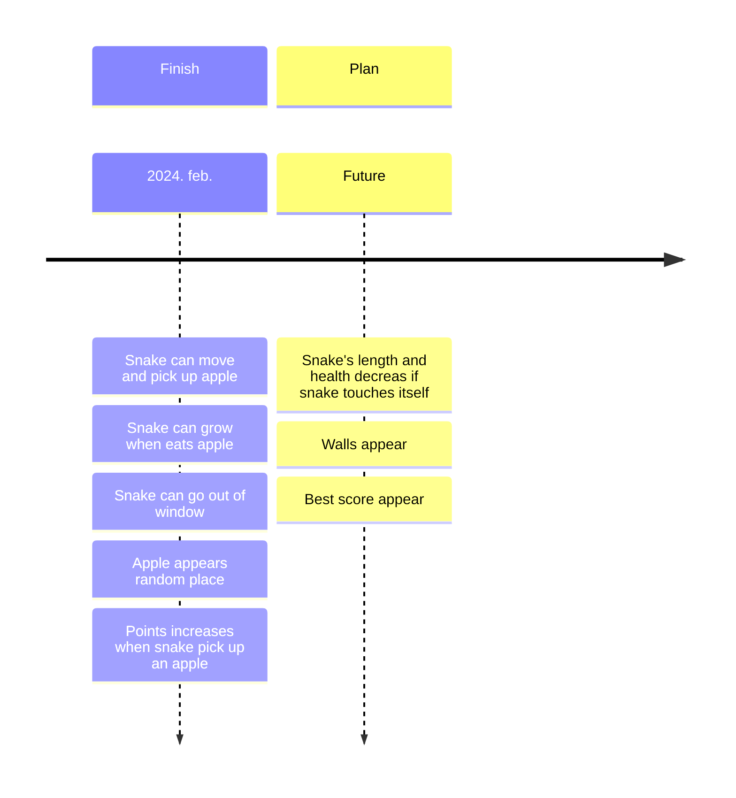

# SNAKE

## About the project
This project is just the simple snake game. But it has some differences:
- the snake can go out of the board in the early stage
- more than 50 points the walls appear, which can kill the snake
- the snake has 3 health
- if the snake touches itself, it will lose a health point and its tail

## Technologies used
* 

## Gettig Started
The project is still under development, so once the first release is ready, an installer will be made available.

Until then:

The project uses SDL2, SDL2 image and SDL2 ttf. 

I use Visual Studio toolchain in CLion, and compiler is cl. 

In Clion:

1. Download vcpkg in Clion
2. Download sdl2, sdl2 image and sdl2 ttf in vcpkg
3. Settings -> CMake -> Cache variables (it is just one line right side of the window; you must open it)
4. You must add all variable's paths. You can find all paths .vcpkg-clion\vcpkg\installed\x64-windows\share. The base location, in windows, C:\Users\user.
5. Build the project
6. Copy all sdl2, sdl2 image and sdl2 ttf dll from the vcpkg directory to build directory. (
    1. .vcpkg-clion\vcpkg\installed\x64-windows\bin
    2. .vcpkg-clion\vcpkg\installed\x64-windows\debug
)

## Roadmap

## Contributor
- [StrangerDeer](https://github.com/StrangerDeer)
