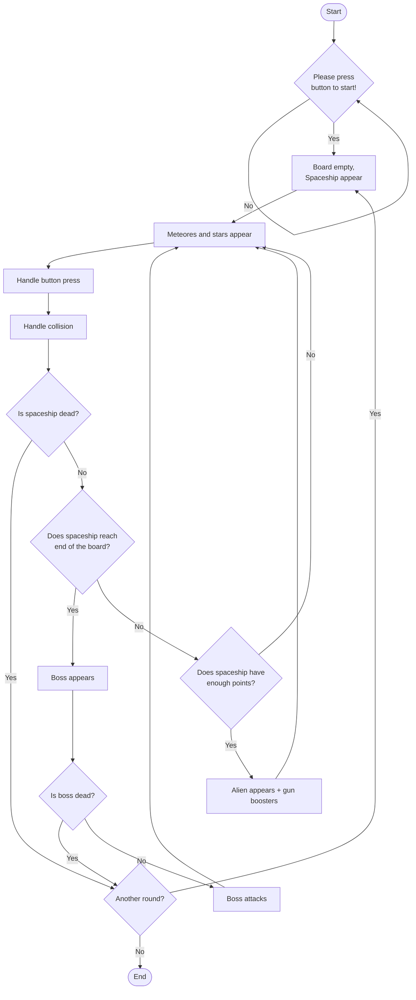
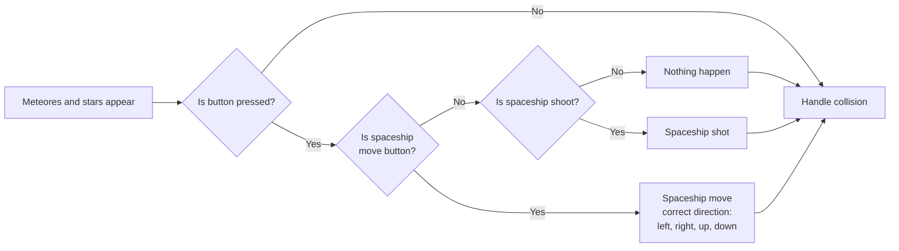
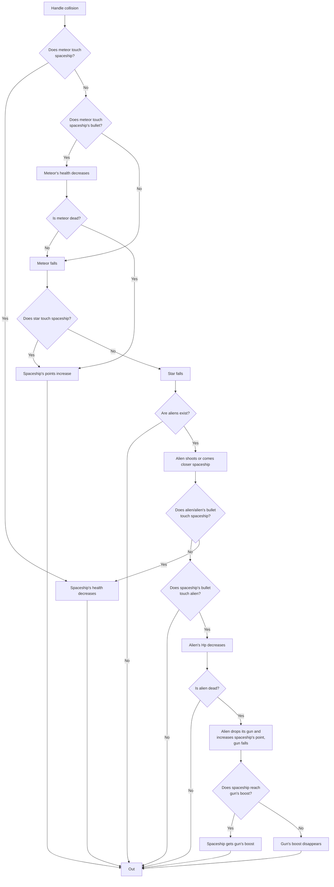

```mermaid
flowchart TD
  start(["Start"])
  anotherround{Another round?}
  endMessage(["End"])
  startMessage{Please press
   button to start!}
  startField[Board empty,
                Spaceship appear]
  meteoresAppear[Meteores and stars appear]
  handleButtonPressed[Handle button press]
  handleTouch[Handle collision]
  isSpaceshipDead{Is spaceship dead?}
  isSpaceshipPoints{Does spaceship have
                     enough points?}
  alienAppear[Alien appears + gun boosters]
  isSpaceshipWon{Does spaceship reach 
  end of the board?}
  bossAppear[Boss appears]
  isBossDead{Is boss dead?}
  bossAttack[Boss attacks]

  start --> startMessage
  startMessage --> |No| startMessage
  startMessage --> |Yes| startField
  startField --> meteoresAppear
  meteoresAppear --> handleButtonPressed
  handleButtonPressed --> handleTouch
  handleTouch --> isSpaceshipDead
  isSpaceshipDead --> |Yes| anotherround
  isSpaceshipDead --> |No| isSpaceshipWon
  isSpaceshipPoints --> |Yes| alienAppear
  alienAppear --> meteoresAppear
  isSpaceshipWon  --> |Yes| bossAppear
  isSpaceshipWon --> |No| isSpaceshipPoints
  bossAppear --> isBossDead
  isBossDead --> |Yes| anotherround
  isBossDead --> |No| bossAttack
  bossAttack --> meteoresAppear
  isSpaceshipPoints --> |No| meteoresAppear
  anotherround --> |Yes| startField
  anotherround --> |No| endMessage

```

```mermaid
flowchart LR

meteoresAppear[Meteores and stars appear]
handleTouch[Handle collision]
isPressedButton{Is button pressed?}
isMove{Is spaceship
 move button?}
spaceshipMove[Spaceship move
              correct direction:
              left, right, up, down]
isSpaceShot{Is spaceship shoot?}
spaceshipShot[Spaceship shot]
nothing[Nothing happen]

meteoresAppear --> isPressedButton
isPressedButton --> |No| handleTouch
isPressedButton --> |Yes| isMove
isMove --> |Yes| spaceshipMove
isMove --> |No| isSpaceShot
isSpaceShot --> |Yes| spaceshipShot
isSpaceShot --> |No| nothing
nothing --> handleTouch
spaceshipShot --> handleTouch
spaceshipMove --> handleTouch

```

```mermaid
flowchart TD

handleTouch[Handle collision]
out[Out]

isMeteorTouchSpaceship{Does meteor touch 
spaceship?}
isMeteorShot{Does meteor touch 
spaceship's bullet?}
isMeteorDead{Is meteor dead?}
isStarTouch{Does star touch spaceship?}
isAlienExist{Are aliens exist?}
isAlienTouch{Does alien/alien's bullet 
touch spaceship?}
isSpaceshipTouchAlien{Does spaceship's bullet 
touch alien?}
isAlienDead{Is alien dead?}
isSpaceshipTouchGunBoost{Does spaceship reach 
gun's boost?}

meteorHealthDecrease[Meteor's health decreases]
spaceshipDecreaseHealth[Spaceship's health decreases]
spaceshipIncreasePoints[Spaceship's points increase]
meteorFallOut[Meteor falls]
starFallOut[Star falls]
alienShot[Alien shoots or comes closer spaceship]
alienHpDecrease[Alien's Hp decreases]
alienDead[Alien drops its gun and
increases spaceship's point,
gun falls]
spaceshipBoost[Spaceship gets gun's boost]
spaceshipMiss[Gun's boost disappears]

handleTouch --> isMeteorTouchSpaceship
isMeteorTouchSpaceship --> |Yes| spaceshipDecreaseHealth
isMeteorTouchSpaceship --> |No| isMeteorShot
isMeteorShot --> |Yes| meteorHealthDecrease
meteorHealthDecrease --> isMeteorDead
isMeteorDead --> |No| meteorFallOut
isMeteorDead --> |Yes| spaceshipIncreasePoints
isMeteorShot --> |No| meteorFallOut
meteorFallOut --> isStarTouch
isStarTouch --> |Yes| spaceshipIncreasePoints
isStarTouch --> |No| starFallOut
starFallOut --> isAlienExist
isAlienExist --> |No| out
isAlienExist --> |Yes| alienShot
alienShot --> isAlienTouch
isAlienTouch --> |No| isSpaceshipTouchAlien
isAlienTouch --> |Yes| spaceshipDecreaseHealth
isSpaceshipTouchAlien --> |No| out
isSpaceshipTouchAlien --> |Yes| alienHpDecrease
alienHpDecrease --> isAlienDead
isAlienDead --> |No| out
isAlienDead --> |Yes| alienDead
alienDead --> isSpaceshipTouchGunBoost
isSpaceshipTouchGunBoost --> |Yes| spaceshipBoost
isSpaceshipTouchGunBoost --> |No| spaceshipMiss


spaceshipIncreasePoints --> out
spaceshipDecreaseHealth --> out
spaceshipBoost --> out
spaceshipMiss --> out
```
